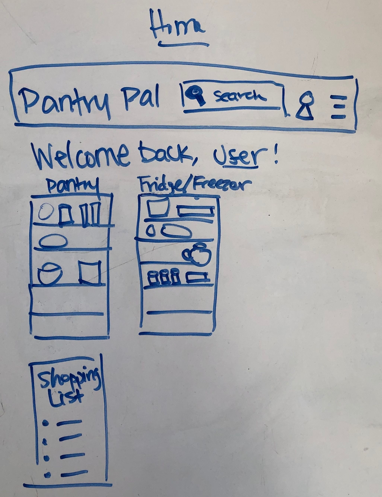
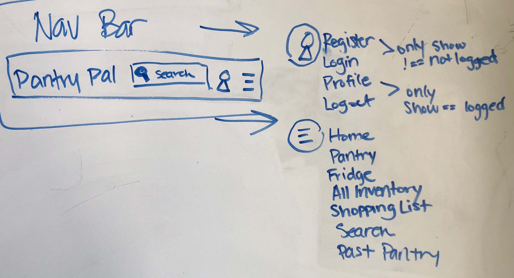
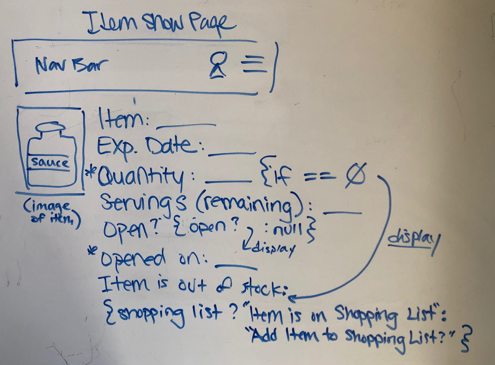

# Pantry Pal
Pantry pal is a webapp that allows users to keep a digital inventory of the food they have in their pantry/refrigerator/freezer, track how much is left of an open item, and add items to their shopping list as they get low/run out/expire so they know exactly what and how much they have/need of all their foods and drinks. 
***
## User Stories
1.  user should be able to register/create a profile and login
2.  user should be able to create a pantry and a fridge
3.  user should be able to log items contained in their pantry and in their fridge (including quantity, expiration, etc.)
4.  (stretch goal) include a food API that contains data for food items that the user can pull by key term search/UPC scan
5.  (stretch goal) user should be able to search a recipe database that uses items existing in their pantry/fridge
6.  (strethc stretch goal) a user can add another user as a family member in their household, who would have access to the pantry and shopping list
***
## Wireframing
#### What data are we working with?
#### User Data
- profile photo (use firestore to store user images?) - string, optional
- email (user firestore for oAuth?), required, string, unique
- username - required, string, unique
- password - required, string
- (stretch goal-recipe builder) allergies, dietary restrictions? - string, array of objects
#### Pantry Data
- item: string, required
- expiration date: Date
- quantity: number, required (if == 0 => out of stock: true)
- servings: number (if 0, decrease quantity by 1?)
- item is open?: boolen (if true, display "opened on date")
- opened on date (set as an onClick button that sets this date using new Date()?): date
- out of stock? Boolean (move to shopping list, archive, or delete?)
- on shopping list: Boolean
- archive to past pantry: Boolean (so user can remove from pantry/fridge without putting on shopping list, but keep item data in case they want to look at their old pantry items and re-add later)
- (stretch goal) upc code: string/number? 
#### Components and/or Routes and their data:
- **Register** (POST) - component to register a new user
- **Login** (POST) - component to login an existing user
- **Profile** (GET) - component to display user data, including profile photo and details about user
- **Logout** - not a component, just a route in a container/app.js?
- **Home** (GET) - component/ container? holds Pantry, Fridge, All Invetory, Shopping List, Past Pantry, Search Results, Item Show
- **Item Show** (GET) - component that displays the details about a single item
- **Pantry/Fridge/Shopping List/Past Pantry** (GET) - ideally these should each just be stateless/functional components that query the database and filter based on the booleans for shopping list, archive, and string fridge/freezer/pantry; should these be separate components (I don't think they need to be separate routes!). Also, each returned item from these get requests should be a clickable link to the show page for that particular item - does this require state? (How can/do I have these filters in a single component but have only the pantry or fridge or list appear? Or, should they each be a separate component with a switch statement that displays pantry, fridge, shopping list depending on which is clicked?)
#### Home Page

#### NavBar

#### Item Show Page

***
## Technologies Used
- Javascript
- HMTL
- CSS
- React
- Mongoose
- Express
- MongoDB
- (stretch goal) Firestore oAuth with google/facebook and cloud storage for user images?